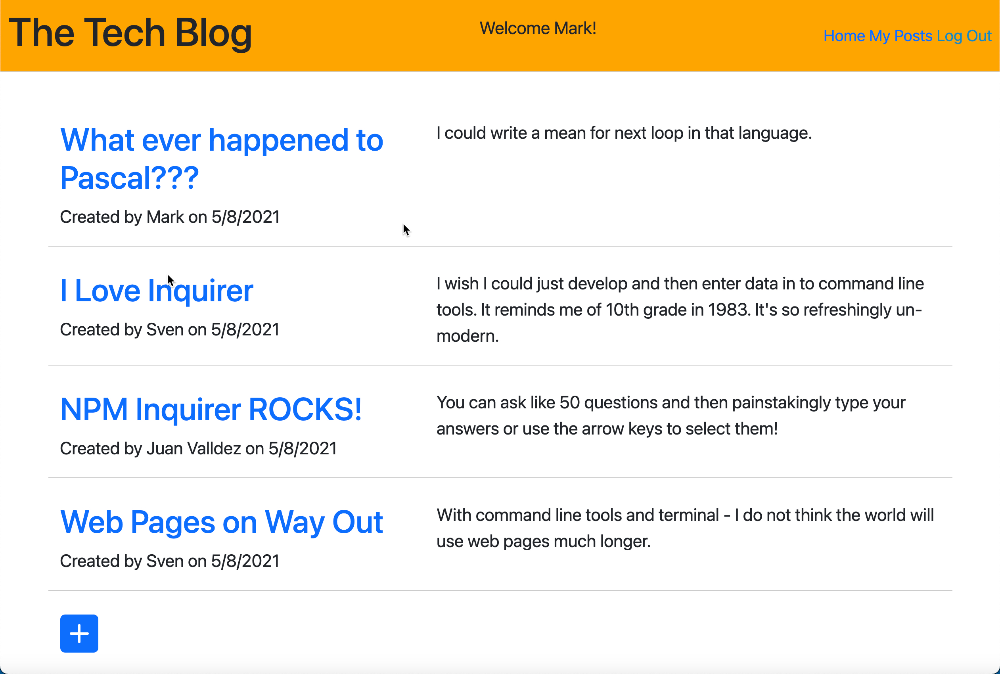

# TechBlog
14 Model-View-Controller (MVC): Tech Blog

## Description
This application provides teh infrastructure for a technology blog. It allows users to view activity for all posts and subsequent comments. If the user registers with the site with an email and password then they are able to add comments to posts as well as add new posts and edit their own posts.

[](https://opensource.org/licenses/MIT)

Sample of the Tech Blog application:<br><br>


## Table of Contents
- [Installation](#installation)
- [Usage](#usage)
- [Credits](#credits)
- [License](#license)
- [Questions](#questions)

## Installation
After cloning the repository there are many dependencies so be sure to navigate to the Develop folder and install dependencies identified in package.json. This application runs Express, Handlebars and mySql2 to name a few. There is also an initial seed of the database with users, posts and comments to get you started.<br>
```npm install```<br>
```npm run seed```<br>
```npm start or nodemon server.js```

Github repsitory [TechBlog](https://github.com/mark-artim/TechBlog)

## Usage

This application is straightforward. You may view posts and comments without being logged in and once registered and loged in you can additionally:
- Add new posts.
- Edit your own posts.
- Add comments to other people's posts.

<br>

## The live site can be reached by clicking this link: [TechBlog](https://serene-gorge-88856.herokuapp.com/)


## Credits
Mim Armand was instrumental in educating me on the technology required for this application as well as Chris Martinez and Jay Yousef for helping me debug issues prior to pulling my hair out.

## License
[](https://opensource.org/licenses/MIT)


## How to Contribute
If you feel web pages are a passing fad and terminal applications are making a comeback then feel free to fork and make pull requests.

## Tests
**There are no unit or other tests for this project**<BR>

## Questions
If you have any questions please contact me at: <br><br>
**mark.artim@gmail.com**<br><br>
or visit me at<br><br>
[**Github**](https://github.com/mark-artim)
        

